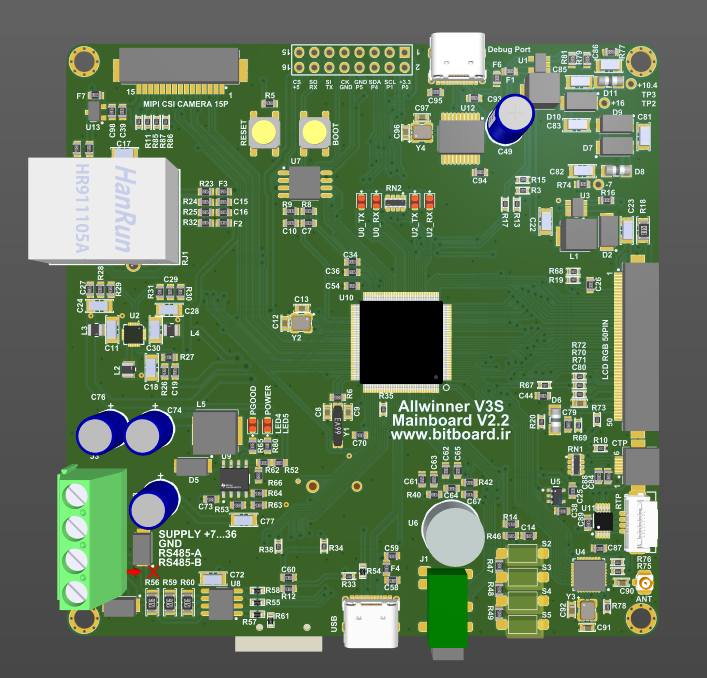

# Allwinner V3s Development Board

This is a powerful and versatile development board based on the **Allwinner V3s** SoC, featuring an **ARM Cortex-A7** processor. Designed for multimedia, graphical, and IoT applications, the board offers a highly integrated platform for embedded systems development.

---

  

---

## 🔧 Key Features

- **SoC**: Allwinner V3s (ARM Cortex-A7 @ 1.2GHz)
- **Memory**:
  - Integrated DDR2 RAM (64MB)
  - External QSPI Flash: W25Q128 (16MB)
- **Power Supply**: 7V–35V DC input via barrel jack
- **USB Interfaces**:
  - Dual USB Type-C ports (for programming & debugging)
- **Display Support**:
  - Up to 7" LCDs with resolutions up to 1024x768
  - Capacitive Touch: GT911 (I2C)
  - Resistive Touch: NS2009 (I2C)
- **Camera Interface**:
  - MIPI CSI camera input (compatible with Raspberry Pi cameras)
- **Audio**:
  - Built-in MEMS microphone
  - Stereo headphone jack
- **Connectivity**:
  - Wi-Fi via ESP8089 (SDIO interface)
  - Ethernet 10/100 Mbps (LAN)
  - RS485 port with TVS protection
- **Storage**:
  - microSD card slot (4-bit SDIO interface)
- **User Interfaces**:
  - 4 ADC-based user buttons
  - Reset and Boot buttons
- **Expansion**:
  - 2x8 pin header for GPIO and peripherals

---
